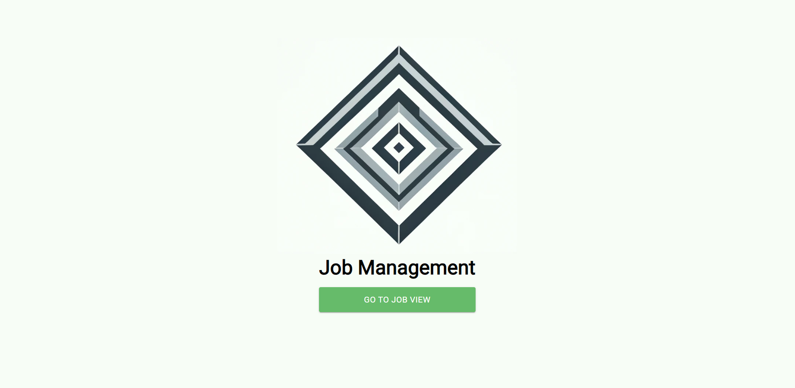
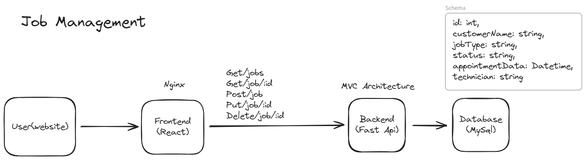
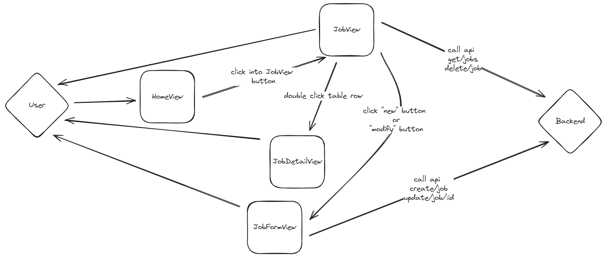
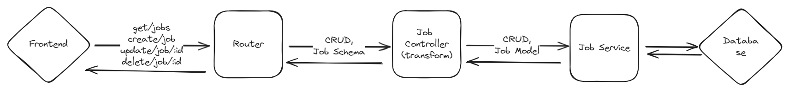
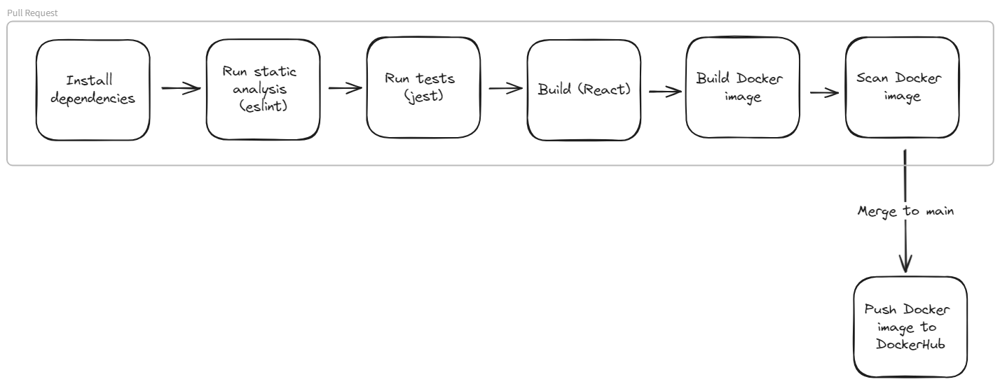
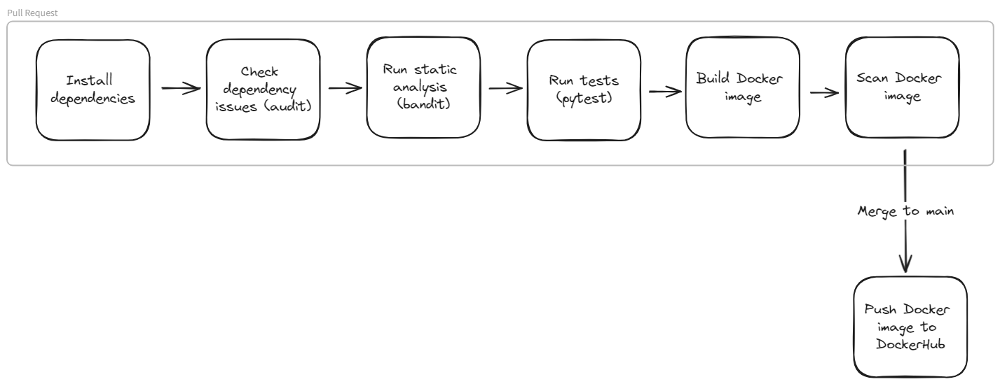
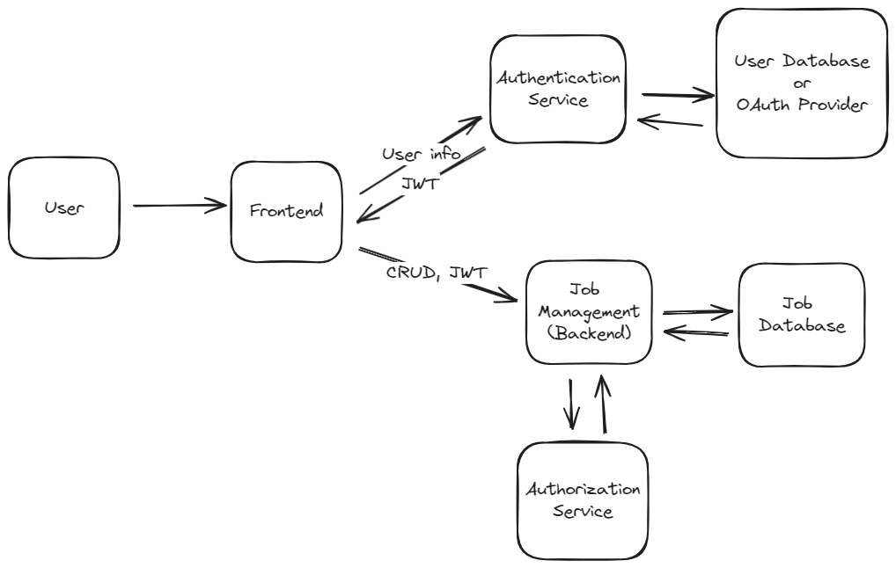

# Job Management




This project is a web app for managing job records. The frontend uses React, the backend uses Python FastAPI and database uses MySql.


### Quick Start

#### Install and Run Docker
1. **Install Docker Desktop:** Follow the instructions on [Docker's official website](https://www.docker.com/products/docker-desktop/) to install Docker Desktop.

2. **Check for Port Availability:**
   - Ensure that ports 3000, 8000, and 3307 are not in use. If they are, stop the services using these ports or reconfigure docker-compose to use different ports.

3. **Run the Application:**
   - Open your terminal or command prompt.
   - Navigate to the `job-management` directory.

   ```bash
   cd job-management
   ```

   - Start the Docker containers using Docker Compose.

   ```bash
   docker-compose up
   ```

4. **Access the Frontend:**
   - Open your web browser and go to [http://localhost:3000](http://localhost:3000) to access the frontend of the application.


### High Level Design



### Frontend Features

- Connects to the backend API
- **HomeView**: Display initial page with logo
- **JobView**: Displays a list of jobs, allows creating, updating, and deleting jobs
- **JobDetailView**: Shows details of a specific job
- **JobFormView**: Handles creating and updating jobs through a form




### Backend Features

- **Backend API**: Handles job records with the following endpoints:
  - `GET /jobs`: Get all jobs
  - `GET /jobs/:id`: Get a job by ID
  - `POST /jobs`: Add a new job
  - `PUT /jobs/:id`: Update a job by ID
  - `DELETE /jobs/:id`: Delete a job by ID



## Architecture
**Frontend** - SPA (Single Page Application)
  - Job management requires high responsiveness and a better user experience, which SPA provides.

**Backend** - MVC Architecture, ORM
  - **Router**: Endpoint definitions
  - **Controller**: Switch schema to model and connect with router and service
  - **Service**: Connect with database using Model
  - **Model**: Database model entity
  - **Schema**: Business schema

**Database** - MySql
  - Stores the Job table for managing job-related data.

### Libraries/Tools Used
**Frontend**
- **React**
  - `react-router`: For handling routing within the application.
  - `axios`: For making HTTP requests.
  - `material-ui`: For implementing styled components.
  - `moment`: For date and time manipulation.
  - `eslint`: For maintaining code quality.
  - `jest`: For running tests.
  - `prettier`: For code formatting.

**Backend**
- **FastAPI**: 
- **Uvicorn**: ASGI server to run FastAPI.
  - `pytest`: For running tests.
  - `SQLAlchemy`: For database ORM.
  - `databases`: For async database support.
  - `PyMySQL`: For MySQL database connectivity.

### CI/CD process
- Using [github action](https://github.com/LowSugarCoke/job-management/actions), it triggers on pull request

**Frontend CI/CD proocess**


**Backend CI/CD process**



### Decisions and Trade-offs

**Frontend**
- `getAllJobs`: Implements initial loading with a boolean flag to prevent multiple calls on page refresh in JobView.
- Job data is sent from JobView to JobDetailsView to reduce service calls and improve loading speed.
- Splits View and Component, and employs self-hooks for high scalability. This approach is similar to injection and dependency methods, allowing the injection of components and hooks into the View to enhance scalability.
- Uses Nginx for load balancing and routing to the correct backend path.

**Backend**
- Use MVC architecture to maintain high scalability for the future.
- Use MySQL in production and SQLite for testing to ensure CRUD operations are correct.
- Utilize dotenv for switching database URLs between environments (production, test, GitHub Actions).
- Implement injection and dependency, allowing the database to be injected from the router to the service, maintaining low coupling (enabling the use of SQLite for the testing environment).

**Database**
- Use a relational database (MySQL) for consistency in job management data.


### Future Improvements

**Frontend**
- Sorting in table view to enhance user experience.
- Keyword search to improve usability.
- Pagination in `JobView` to limit and manage data loads efficiently.

 
**Backend**
- Caching in the backend to reduce database load
  
**Database**
- Using multiple tables with foreign keys for complex data to reduce duplication

**Authentication and Authorization**
- Use JSON Web Tokens (JWT) to authenticate and authorize users, ensuring secure access to the application
- Implement JWT validation to verify that incoming requests are from authorized users, enhancing the security of the application





### Installation

To get your development environment running, refer to the individual README files located in the project directories:

- **Frontend Setup**: See instructions in `frontend/README.md`.
- **Backend Setup**: See instructions in `backend/README.md`.

### Authors

- **Jack Lee**

